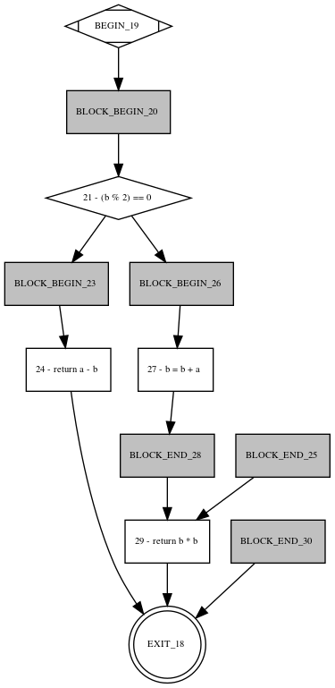

Spoon Control Flow
==================

A module for control-flow analysis of Java software
Code by @marcelinorc.

```java
ControlFlowBuilder visitor = new ControlFlowBuilder();
factory.getModel().getRootPackage().accept(visitor);
ControlFlowGraph graph = visitor.getResult();

```




Can produce Dot visualization:

```
digraph null { 
node [fontsize = 8];
1 [shape=Mdiamond, label="BEGIN_19 "];
2 [shape=rectangle, style=filled, fillcolor=gray, label="BLOCK_BEGIN_20 "];
3 [shape=diamond, label="21 - (b % 2) == 0 "];
4 [shape=rectangle, style=filled, fillcolor=gray, label="BLOCK_BEGIN_23 "];
5 [shape=rectangle, label="24 - return a - b "];
6 [shape=doublecircle, label="EXIT_18 "];
7 [shape=rectangle, style=filled, fillcolor=gray, label="BLOCK_END_25 "];
8 [shape=rectangle, style=filled, fillcolor=gray, label="BLOCK_BEGIN_26 "];
9 [shape=rectangle, label="27 - b = b + a "];
10 [shape=rectangle, style=filled, fillcolor=gray, label="BLOCK_END_28 "];
11 [shape=rectangle, label="29 - return b * b "];
12 [shape=rectangle, style=filled, fillcolor=gray, label="BLOCK_END_30 "];
1 -> 2 ;
 2 -> 3 ;
 3 -> 4 ;
 4 -> 5 ;
 5 -> 6 ;
 3 -> 8 ;
 8 -> 9 ;
 9 -> 10 ;
 11 -> 6 ;
 12 -> 6 ;
 7 -> 11 ;
 10 -> 11 ;
 
 }
```
